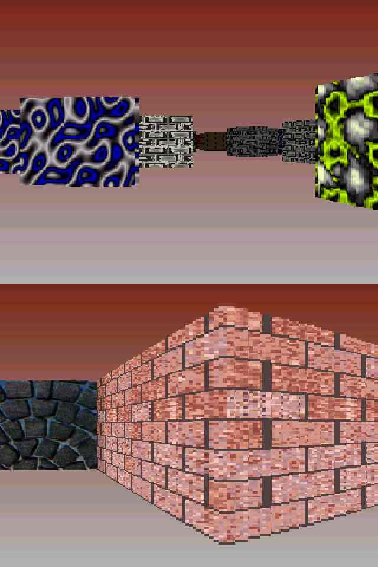



## aMAZEing 3D

### Description

RARE! Look @ the screenshot NOW. These are actual screenshots of the in game graphics - in LOW resolution so that this page didn't take forever to download!!! It IS possible to make a 3D, lighted, perpective texture mapped game in VB! And this game does NOT use any C++ DLL's (like I see some others do), does NOT use any special controls apart from a few plain old pictureboxes. It does NOT use DirectX or OpenGL. Yet the game still runs fast enough on my 400Mhz PC with huge 3D textured levels when it was written in pure VB code! Has this ever been done before? If it has - I haven't seen it! At least one of the techniques used here is totally original and invented by me. Then download includes ten levels ranging from small to huge, plus you can draw your own in any paint program!!! This is so simple and powerful code YOU WILL BE BLOWN AWAY. This all started last month when one of my friends said that a 3D game in VB was not possible so I spent a long time racking my brains and then 2 weeks programming. These are the results so far, and the game will get better. PLEASE SHOW THAT THESE EFFORTS ARE APPRECIATED. If this code is helpful, well done or simply aMAZEing then please vote for me. Feedback is also welcome but please do not complain that it is too slow - what do you expect? How many other games have graphics like this? It would be an achievement if it ran at 1 frame per second! Other people send in a boring old 3D cube, I give you a whole 3D textured level with two choices of graphical style - realistic or surreal. Enjoy, and when this game is faster, has enemies and guns, and looks just like Doom, I'll send in the finished game.
 
### More Info
 

             |
---                |---
**Submitted On**   |2000-05-30 19:39:18
**By**             |[Simon Price](https://github.com/Planet-Source-Code/PSCIndex/blob/master/ByAuthor/simon-price.md)
**Level**          |Intermediate
**User Rating**    |4.6 (219 globes from 48 users)
**Compatibility**  |VB 5\.0, VB 6\.0
**Category**       |[DirectX](https://github.com/Planet-Source-Code/PSCIndex/blob/master/ByCategory/directx__1-44.md)
**World**          |[Visual Basic](https://github.com/Planet-Source-Code/PSCIndex/blob/master/ByWorld/visual-basic.md)
**Archive File**   |[CODE\_UPLOAD6562682000\.zip](https://github.com/Planet-Source-Code/simon-price-amazeing-3d__1-8751/archive/master.zip)

